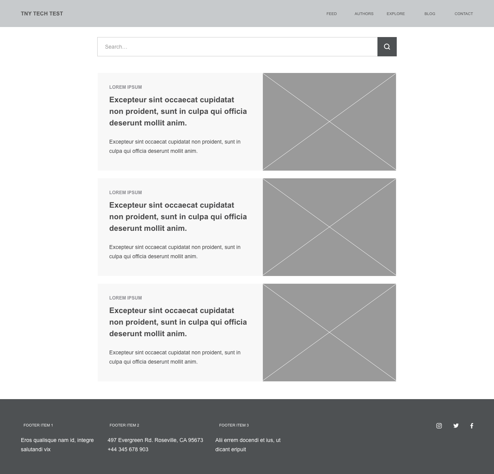
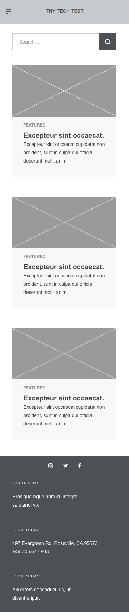

# _The New Yorker_ Technical Test

Hello and welcome to _The New Yorker_ Technical Test! Within this repo, you will find the technical assignment required for the completion of _The New Yorker_ Product Engineering (Web) interviewing process.

Before we begin, here are a few key points to keep in mind as you tackle this assignment and its requirements:
## Key Points
1. :heavy_exclamation_mark: This assignment is one (1) of many criteria that will be evaluated about a candidate. So, please remember to **read the instructions carefully**, **be thoughtful**, and **don't be afraid to show your creativity**
2. Candidates should take **no more than eight (8) hours** to complete this assignment. **This work time can be spread across a seventy-two (72) hour turnaround period**
3.  Candidates are expected to:
    * Clone this main repo **(Please do not fork this repo!)**
    * Make changes in the cloned repo
    * Incremental commits are encouraged to visualize how the application evolved during the development
    * Update **README** file with clear instructions on how to set up and run the application
    * Once completed, push the changes in your github repository
    * Share the repository link. The resulting repo must be set to **public**
4. This assignment is **tiered** with a few **optional tasks**. Candidates are required to:
    * Complete the basic application requirements
    * Complete the requirements mapped to the engineering level they are interviewing for

  > **Optional tasks** have been provided as a creative challenge for those who are interested but they are **not required** for your assignment to be eligible for review

5. Candidates should reach out to their recruiting contact if they have any further questions

## The Assignment

| Skip to: |
| --- |
| [Basic Application Requirements](#basic-application-requirements) |
| [Additional Tiered Requirements](#additional-tiered-requirements) |
| [Optional Tasks for All levels](#optional-tasks-for-all-levels) |

### Instructions

All candidates are asked to build a React app that:
1. Renders a front-end client
2. Has a back-end interface that interacts with the designated REST API -- NewsAPI (https://newsapi.org/)

Your application's front-end client must be built on the foundation of the boilerplate app presented in this repo. Feel free to **add**, **remove**, and **modify** any files as needed. **Please refrain from implementing `create-react-app` or `create-next-app` in your project as it will NOT be viewed as an acceptable change.**

You must be sure to acquire a public API Key for your application's back-end interface so that your branch can be run locally.

Your application must follow these minimum application requirements:

## Basic Application Requirements

A candidate's application must follow the **general format** of these wireframed layouts:

| Desktop | Mobile |
| ------- | :----: |
|  |  |

### Front-end requirements
* Must have a navigation
* Must display a card-based layout of stories on the landing page
* Must have a footer
* Must be responsive for mobile devices
* Story items must render an image, header, and description
* Story items must click through to the larger article
* Must apply a **design system** to the application's UI. Candidates can use one (1) of the following design systems or any other design system they may be familiar with:
  * [Material UI](https://mineral-ui.netlify.app/)
  * [Elastic UI](https://elastic.github.io/eui/#/)

  > **Please note that Bootstrap is NOT a design system**

### Back-end requirements
* Must make a successful HTTP request to the REST API when ran locally
* Must provide data to the front-end client for rendering

## Additional Tiered Requirements
| Levels |
| --- |
| [Junior-level (Associate SE) Candidates](docs/junior-level.md) |
| [Mid-level (SE1) Candidates](docs/mid-level.md) |
| [Senior-level (SE2) Candidates](docs/senior-level.md) |
| [Principal-level (SE3) Candidates](docs/principal-level.md) |
## Optional Tasks for All levels

**_These tasks are optional and are not required for a candidate's test to be reviewed._** If time permits, candidates can attempt to add any of the following:
* Image lazy loading
* One (1) error page state for when a non `ok` status is given by the REST API

Mid- to Senior-level candidates can also attempt to:
* Render A11y compliant components
* Add auto-complete to the search bar feature
* Incorporate deep link routes that point to a single story item and displays the item's `content` vs its `description`

## The Wrap-up

Again, please adhere to the instructions provided and we look forward to reviewing your submissions.

Happy coding!

